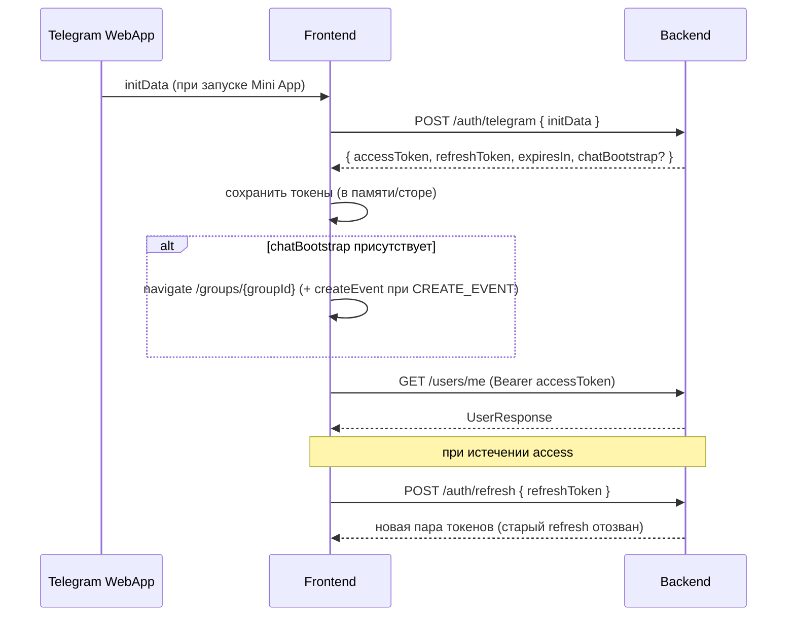

# Интеграция с API

Бэкенд живёт в репозитории `../skinemsya_java` (Spring Boot). Это **единственный источник истины** по доступному функционалу. Главное правило проекта:

> **Реализуем на фронте только то, для чего есть эндпоинт на бэке.** Если функции нет в этом документе и нет в коде бэкенда — её не существует для фронта.

База API: `/api/v1`. Авторизация — JWT через заголовок `Authorization: Bearer <accessToken>`. Сессии stateless (без cookie).

---

## 1. Доступные эндпоинты (актуально)

Реализовано **10 доменов**: `auth`, `users/profile`, `groups`, `events`, `files`, `receipts` (positions/selections), `debts`, `payments`, `notifications` (remind).

### Домен Auth (без авторизации)

#### `POST /api/v1/auth/telegram`
Вход через Telegram Mini App. Валидирует `initData`, создаёт/обновляет пользователя, выдаёт пару токенов.

Запрос:
```json
{ "initData": "<Telegram.WebApp.initData raw query string>" }
```

Ответ `200`:
```json
{
  "accessToken": "eyJ...",
  "refreshToken": "uuid-string",
  "expiresIn": 900,
  "chatBootstrap": {
    "groupId": 42,
    "groupName": "Office lunch",
    "groupType": "CHAT_LINKED",
    "suggestedAction": "CREATE_EVENT"
  }
}
```
- `expiresIn` — TTL access-токена в **секундах** (по умолчанию 900 = 15 мин).
- `chatBootstrap` — **опционально**, только если Mini App открыт **из Telegram-чата** (в `initData` есть chat context). Бэкенд автоматически создаёт/привязывает chat-linked группу (эквивалент `POST /groups/chat-linked`) и подсказывает следующий шаг:
  - `CREATE_EVENT` — открыть группу и предложить создать сбор;
  - `OPEN_APP` — просто открыть группу.
- При `POST /auth/refresh` поле `chatBootstrap` **не возвращается**.
- Ошибка `401 AUTHENTICATION_ERROR` — неверная подпись/просроченный `initData`.

#### `POST /api/v1/auth/refresh`
Ротация refresh-токена и выпуск нового access.

Запрос:
```json
{ "refreshToken": "uuid-string" }
```
Ответ `200`: та же структура `TokenResponse`.
- При обновлении старый refresh-токен **отзывается** (rotation) — нужно сохранять оба новых токена.
- Ошибка `401` — токен отсутствует/недействителен/отозван/просрочен.

> Эндпоинта logout/revoke **нет**. Выход = удаление токенов на клиенте.

### Домен Users / Profile (требует авторизации)

#### `GET /api/v1/users/me`
Текущий пользователь + профиль.

Ответ `200`:
```json
{
  "id": 1,
  "telegramUserId": 100001,
  "displayName": "Alice",
  "paymentDetails": null,
  "phone": null,
  "notificationSettings": null
}
```

#### `PUT /api/v1/users/me/profile`
Обновление профиля. Все поля опциональны, но обновление **заменяет** значения (не частичный merge на уровне сервиса).

Запрос:
```json
{
  "paymentDetails": "Карта **** 1234",
  "phone": "+79001234567",
  "notificationSettings": "{\"push\":true}"
}
```
Валидация: `paymentDetails` ≤ 2000 символов, `phone` ≤ 20 символов, `notificationSettings` — произвольная строка (на бэке JSONB, в API — opaque-строка).

Ответ `200`: полный `UserResponse`.

### Домен Groups (требует авторизации)

#### `POST /api/v1/groups/standalone`
Создание обычной группы.

Запрос: `{ "name": "Поездка" }` — `name` ≤ 255 символов.

Ответ `201`: `GroupResponse`.

#### `POST /api/v1/groups/chat-linked`
Создание/привязка группы к Telegram-чату из `initData` (нужен chat context).

Запрос: `{ "initData": "<raw initData>" }`.

Ответ `200`: `GroupResponse`.

#### `GET /api/v1/groups`
Список групп текущего пользователя (пагинация).

Query: `?page=0&size=20` (оба опциональны; по умолчанию page=0, size=20).

Ответ `200`: `PageResult<GroupResponse>`.

#### `GET /api/v1/groups/{groupId}`
Детали группы (только для участников).

Ответ `200`: `GroupResponse`.

#### `PUT /api/v1/groups/{groupId}`
Переименование группы (только owner).

Запрос: `{ "name": "Новое имя" }`.

Ответ `200`: `GroupResponse`.

#### `GET /api/v1/groups/{groupId}/members`
Список участников группы (только для участников, пагинация).

Query: `?page=0&size=20`.

Ответ `200`: `PageResult<GroupMemberViewResponse>` — id, userId, role, displayName, telegramUsername, telegramUserId, joinedAt.

#### `POST /api/v1/groups/{groupId}/members`
Добавление участника по Telegram @username (только owner, только STANDALONE).

Запрос: `{ "telegramUsername": "ivan" }` или `"@ivan"`.

Валидация `telegramUsername`:
- 5–32 символа после нормализации;
- допустимы `a-z`, `0-9`, `_` (регистр не важен, на бэке приводится к lowercase);
- префикс `@` опционален;
- пользователь должен хотя бы раз войти в Mini App (иначе `404 NOT_FOUND`).

Ответ `201`: `GroupMemberViewResponse`.

#### `DELETE /api/v1/groups/{groupId}`
Удаление группы (только owner, без активных сборов).

Ответ `204`.

### Домен Events (требует авторизации)

#### `POST /api/v1/groups/{groupId}/events`
Создание сбора в группе.

Запрос:
```json
{
  "name": "Ужин",
  "description": "Необязательно, ≤ 5000",
  "payerId": 1
}
```
`payerId` — внутренний `user.id` участника группы.

Ответ `201`: `EventResponse` (статус `DRAFT`).

#### `GET /api/v1/groups/{groupId}/events`
Список сборов группы (новые сверху, пагинация).

Query: `?page=0&size=20`.

Ответ `200`: `PageResult<EventResponse>`.

#### `GET /api/v1/events/{eventId}`
Детали сбора.

Ответ `200`: `EventResponse`.

#### `PUT /api/v1/events/{eventId}`
Обновление сбора (только в статусе `DRAFT`).

Запрос: как при создании.

Ответ `200`: `EventResponse`.

#### `DELETE /api/v1/events/{eventId}`
Удаление сбора (только `DRAFT`, создатель или owner группы).

Ответ `204`.

### Инфраструктура (не для UI)
`GET /actuator/health`, `/actuator/info`, `/v3/api-docs`, `/swagger-ui.html` — не используются в приложении.

---

## 2. Типы DTO (TypeScript)

Эти типы держим в `shared/api` и переиспользуем в доменах.

```ts
// shared/api/dto.ts
export interface TelegramAuthRequest { initData: string; }
export interface RefreshTokenRequest { refreshToken: string; }

export interface TokenResponse {
  accessToken: string;
  refreshToken: string;
  expiresIn: number; // seconds
  chatBootstrap?: ChatBootstrapResponse | null;
}

export type ChatSuggestedAction = 'CREATE_EVENT' | 'OPEN_APP';

export interface ChatBootstrapResponse {
  groupId: number;
  groupName: string;
  groupType: GroupType;
  suggestedAction: ChatSuggestedAction;
}

export interface UserResponse {
  id: number;
  telegramUserId: number;
  displayName: string;
  paymentDetails: string | null;
  phone: string | null;
  notificationSettings: string | null;
}

export interface UpdateProfileRequest {
  paymentDetails?: string; // <= 2000
  phone?: string;          // <= 20
  notificationSettings?: string;
}

export type GroupType = 'CHAT_LINKED' | 'STANDALONE';
export type GroupRole = 'OWNER' | 'MEMBER';
export type EventStatus = 'DRAFT' | 'DISTRIBUTION' | 'CALCULATED' | 'COMPLETED';

export interface GroupResponse {
  id: number;
  name: string;
  type: GroupType;
  telegramChatId: number | null;
  ownerId: number;
  createdAt: string;
  updatedAt: string;
}

export interface GroupMemberViewResponse {
  id: number;
  groupId: number;
  userId: number;
  role: GroupRole;
  displayName: string;
  telegramUsername: string | null;
  telegramUserId: number;
  joinedAt: string;
}

export interface CreateStandaloneGroupRequest { name: string; }
export interface ChatLinkedGroupRequest { initData: string; }
export interface UpdateGroupRequest { name: string; }
export interface AddGroupMemberRequest { telegramUsername: string; }

export interface EventResponse {
  id: number;
  groupId: number;
  name: string;
  description: string | null;
  payerId: number;
  createdBy: number;
  status: EventStatus;
  createdAt: string;
  updatedAt: string;
}

export interface CreateEventRequest {
  name: string;
  description?: string;
  payerId: number;
}

export interface UpdateEventRequest {
  name: string;
  description?: string;
  payerId: number;
}

export interface ApiErrorResponse {
  code: ApiErrorCode;
  message: string;
  correlationId?: string;
  fields?: Array<{ field: string; message: string }>;
}

export type ApiErrorCode =
  | 'VALIDATION_ERROR'      // 400
  | 'AUTHENTICATION_ERROR'  // 401
  | 'AUTHORIZATION_ERROR'   // 403
  | 'NOT_FOUND'             // 404
  | 'DOMAIN_CONFLICT'       // 409
  | 'DOMAIN_RULE_VIOLATION' // 422
  | 'INTEGRATION_ERROR'     // 502
  | 'INTERNAL_ERROR';       // 500

export interface PageResult<T> {
  items: T[];
  page: number;
  size: number;
  totalElements: number;
}
```

---

## 3. Флоу авторизации



Рекомендации по хранению токенов:
- Держать токены в Zustand-сторе (в памяти). Для переживания перезапуска — допустимо кешировать `refreshToken` в `CloudStorage` Telegram (см. [TELEGRAM_MINIAPP.md](TELEGRAM_MINIAPP.md)); `accessToken` хранить только в памяти.
- Проактивно обновлять access за ~30–60с до `expiresIn`.
- При `401` на защищённом запросе — один раз попробовать `refresh`, затем повторить запрос; если refresh не удался — снова авторизоваться через `initData`.

---

## 4. HTTP-клиент (ky) и перехватчики

`shared/api/client.ts` — единый клиент с авто-подстановкой токена, нормализацией ошибок и авто-рефрешем.

```ts
// shared/api/client.ts (схема)
import ky from 'ky';
import { useSessionStore } from '@/features/auth';
import { API_BASE_URL } from '@/shared/config';

export const api = ky.create({
  prefixUrl: API_BASE_URL, // .../api/v1
  retry: 0,
  hooks: {
    beforeRequest: [
      (req) => {
        const token = useSessionStore.getState().accessToken;
        if (token) req.headers.set('Authorization', `Bearer ${token}`);
      },
    ],
    afterResponse: [
      async (req, _opts, res) => {
        if (res.status !== 401) return res;
        const ok = await useSessionStore.getState().refresh();
        if (!ok) return res; // вызовет повторную авторизацию выше
        const token = useSessionStore.getState().accessToken;
        req.headers.set('Authorization', `Bearer ${token}`);
        return ky(req); // повтор запроса
      },
    ],
  },
});

export async function parseApiError(res: Response): Promise<ApiErrorResponse> {
  try { return await res.json(); }
  catch { return { code: 'INTERNAL_ERROR', message: 'Unknown error' }; }
}
```

Опционально можно слать заголовок `X-Correlation-Id` для трассировки.

---

## 5. Паттерн запросов (TanStack Query + скелетоны)

Статусы Query завязаны на UI-состояния из дизайн-системы: загрузка → скелетон, ошибка → `ErrorState`, пусто → `EmptyState`.

```ts
// features/profile/api/queries.ts
import { useQuery, useMutation, useQueryClient } from '@tanstack/react-query';
import { api } from '@/shared/api';
import type { UserResponse, UpdateProfileRequest } from '@/shared/api/dto';

export const profileKeys = { me: ['profile', 'me'] as const };

export function useProfileQuery() {
  return useQuery({
    queryKey: profileKeys.me,
    queryFn: () => api.get('users/me').json<UserResponse>(),
  });
}

export function useUpdateProfile() {
  const qc = useQueryClient();
  return useMutation({
    mutationFn: (body: UpdateProfileRequest) =>
      api.put('users/me/profile', { json: body }).json<UserResponse>(),
    onSuccess: (data) => qc.setQueryData(profileKeys.me, data),
  });
}
```

```tsx
// features/profile/ui/ProfileScreen.tsx (схема)
function ProfileScreen() {
  const { data, isLoading, isError } = useProfileQuery();
  if (isLoading) return <ProfileSkeleton />;
  if (isError)   return <ErrorState onRetry={...} />;
  return <ProfileContent user={data} />;
}
```

Обработка ошибок мутаций — через `code`/`fields` из `ApiErrorResponse`: показываем `Toast` по `message`, а `fields[]` маппим на ошибки полей формы (react-hook-form).

---

## 1b. Phase 4–6 эндпоинты (files, positions, debts, payments)

### Files

| Method | Path | Описание |
| --- | --- | --- |
| `POST` | `/files?purpose=receipt\|payment-proof` | multipart `file` — загрузка файла (`receipt`: только image; `payment-proof`: image + PDF). Лимит: `skinemsya.file-storage.max-upload-size-bytes` (default 20MB) |
| `GET` | `/files/{id}` | метаданные файла |
| `GET` | `/files/{id}/content` | бинарное содержимое |

### Positions & Receipts (event в `DRAFT`)

| Method | Path | Описание |
| --- | --- | --- |
| `GET` | `/events/{eventId}/positions` | список позиций |
| `POST` | `/events/{eventId}/positions` | `{ name, quantity, totalPriceKopecks }` |
| `PUT` | `/positions/{id}` | обновление позиции |
| `DELETE` | `/positions/{id}` | удаление |
| `POST` | `/positions/{id}/mark-shared` | `{ forAll: true }` — «На всех» |
| `POST` | `/events/{eventId}/receipts` | `{ fileId }` — ML-парсинг чека |
| `GET` | `/events/{eventId}/receipts` | список чеков сбора (участники) |
| `POST` | `/events/{eventId}/receipts/{id}/split-tips` | разделить чаевые |
| `GET` | `/files/{fileId}/content?sharedAccess=true` | изображение чека для участников сбора |
| `POST` | `/events/{eventId}/send-to-distribution` | запустить сбор → `DISTRIBUTION` (допускается 1 участник) |
| `POST` | `/events/{eventId}/close` | плательщик закрывает сбор → `COMPLETED` (все долги должны быть `PAID`) |

### Selections (event в `DISTRIBUTION`)

| Method | Path | Описание |
| --- | --- | --- |
| `PUT` | `/events/{eventId}/selections` | `{ selections: [{ positionId, quantity }] }` |
| `POST` | `/events/{eventId}/complete-selection` | завершить выбор участника; создаёт предварительный долг для должника |

### Debts

| Method | Path | Описание |
| --- | --- | --- |
| `GET` | `/events/{eventId}/debts` | долги сбора; в ответе `paymentStatus` (`DEBTOR_CONFIRMED`, `DISPUTED`, …) для UI плательщика |
| `GET` | `/debts/summary` | сводка для главного экрана |
| `GET` | `/events/{eventId}/participants-status` | прогресс и статусы участников |

### Payments

| Method | Path | Описание |
| --- | --- | --- |
| `GET` | `/debts/{debtId}/payment-details` | сумма + реквизиты плательщика |
| `POST` | `/debts/{debtId}/payment/confirm-debtor` | `{ screenshotFileId }` — «Отправил» |
| `POST` | `/events/{eventId}/payments/confirm-all` | «Всё на месте» (bulk) |
| `POST` | `/debts/{debtId}/payment/confirm-payer` | подтверждение по долгу |
| `POST` | `/debts/{debtId}/payment/dispute` | «Не пришло» |
| `POST` | `/payments/{id}/confirm-payer` | подтверждение по payment id |
| `POST` | `/payments/{id}/dispute` | спор по payment id |

### Notifications

| Method | Path | Описание |
| --- | --- | --- |
| `POST` | `/events/{eventId}/remind` | напомнить не выбравшим / не скинувшим |

### Deep links

| Формат | Назначение |
| --- | --- |
| `startapp=chat_{chatId}` | вход в группу |
| `startapp=event_{eventId}` | вход на экран сбора |

`chatBootstrap` может содержать `eventId` при входе по `event_{id}`.

---

## 6. Чего на бэке ПОКА НЕТ (не реализовывать)

| Домен | Статус |
| --- | --- |
| Groups, Events, Files, Positions, Debts, Payments | **Реализовано** — см. §1 и §1b |
| Real-time (WebSocket/SSE) | Не реализовано |
| SBP / банковские webhooks | Post-MVP |
| Logout/revoke | Не реализовано |

Если для задачи нужен отсутствующий эндпоинт — остановиться и сообщить, что бэкенд не готов, вместо выдумывания API. При сомнениях — сверяться с контроллерами в `../skinemsya_java` (поиск `@RestController`, `@GetMapping`, `@PostMapping`).
