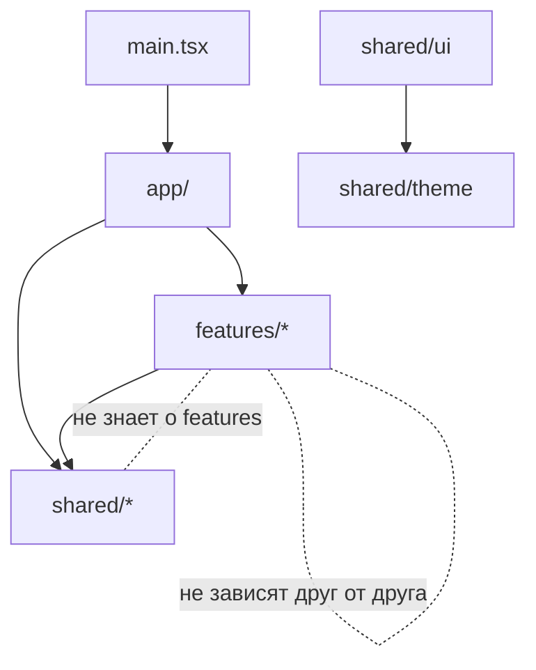

# Структура проекта

Архитектура — **доменно-ориентированная** (feature-sliced по смыслу). Код делится по бизнес-доменам, а всё переиспользуемое выносится в общий слой `shared`. Цель — чтобы по структуре было сразу понятно, «что есть в приложении», и чтобы домены не зависели друг от друга напрямую.

> Важно: домен в `features/` создаётся **только если для него есть API на бэке** (см. [API.md](API.md)). Реализованы: `auth`, `profile`, `groups`, `events`, `files`, `positions`, `selections`, `debts`, `payments`.

---

## 1. Дерево каталогов

```
skinemsya_ui/
├── public/                     # статические файлы, манифест
├── src/
│   ├── app/                    # инициализация приложения
│   │   ├── providers/          # QueryClient, Router, Theme, Telegram провайдеры
│   │   ├── router/             # объявление маршрутов
│   │   ├── AppSplash.tsx       # анимированный экран загрузки (Rive)
│   │   └── App.tsx             # корневой компонент
│   │
│   ├── shared/                 # переиспользуемое ядро (не знает о доменах)
│   │   ├── ui/                 # компоненты дизайн-системы (Button, Card, Input...)
│   │   ├── theme/              # vanilla-extract: токены и контракт темы
│   │   ├── api/                # ky-клиент, перехватчики, общие типы DTO, ошибки
│   │   ├── lib/                # хелперы и хуки (motion, format, haptics...)
│   │   ├── config/             # env, константы
│   │   └── types/              # общие типы
│   │
│   ├── features/               # бизнес-домены
│   │   ├── auth/
│   │   ├── profile/
│   │   ├── groups/
│   │   ├── events/
│   │   ├── files/
│   │   ├── positions/
│   │   ├── selections/
│   │   ├── debts/
│   │   └── payments/
│   │
│   ├── assets/                 # шрифты, rive/lottie, изображения
│   └── main.tsx                # точка входа
│
├── docs/                       # документация (этот каталог)
├── AGENTS.md
├── README.md
├── index.html
├── package.json
├── tsconfig.json
└── vite.config.ts
```

---

## 2. Слои и их зоны ответственности

### 2.1 `app/`
Сборка приложения воедино: провайдеры (React Query, Router, тема, Telegram SDK), корневой роутинг, splash-экран. Здесь — единственная «глобальная» логика инициализации (старт SDK, восстановление сессии, первый запрос профиля).

### 2.2 `shared/`
Фундамент, не зависящий от доменов. **Никогда не импортирует из `features/`.**

- **`shared/ui`** — все переиспользуемые компоненты дизайн-системы (см. §3). Это требование проекта: переиспользуемые компоненты вынесены в отдельные модули.
- **`shared/theme`** — токены/тема (vanilla-extract). Единственный источник визуальных значений ([DESIGN_SYSTEM.md](DESIGN_SYSTEM.md)).
- **`shared/api`** — HTTP-клиент `ky`, перехватчики (auth-заголовок, авто-рефреш), типы DTO бэка, нормализация `ApiErrorResponse`.
- **`shared/lib`** — утилиты и хуки общего назначения: пресеты `motion`, форматирование денег/дат, обёртка над haptics, `useMediaQuery`, `useReducedMotion`.
- **`shared/config`** — переменные окружения, базовый URL API, константы.

### 2.3 `features/<домен>/`
Каждый домен самодостаточен и имеет единый публичный вход `index.ts` (barrel), наружу торчит только он. Внутренняя структура домена:

```
features/profile/
├── api/            # запросы/мутации домена (поверх shared/api)
│   ├── queries.ts  # useProfileQuery и т.п. (TanStack Query)
│   └── dto.ts      # типы, специфичные для домена
├── model/          # доменная логика, zod-схемы, стор (если нужен)
├── ui/             # компоненты, специфичные для домена
│   ├── ProfileScreen.tsx
│   ├── ProfileSkeleton.tsx
│   └── EditProfileSheet.tsx
├── hooks/          # доменные хуки
└── index.ts        # публичный API домена
```

Правила зависимостей:
- `features` → могут использовать `shared`.
- `features` → **не** импортируют другие `features` напрямую; взаимодействие — через `app`/роутинг или общие контракты в `shared`.
- `shared` → не знает про `features`.

---

## 3. Переиспользуемые компоненты (`shared/ui`)

Каждый компонент — отдельный модуль-папка: реализация, стили (vanilla-extract), типы и реэкспорт.

```
shared/ui/Button/
├── Button.tsx
├── Button.css.ts
└── index.ts
```

Базовый каталог компонентов (создаются по мере надобности, но дизайн заложен в [DESIGN_SYSTEM.md](DESIGN_SYSTEM.md)):

| Категория | Компоненты |
| --- | --- |
| Действия | `Button`, `IconButton`, `Fab` |
| Ввод | `Input`, `Textarea`, `Select`, `Switch`, `Checkbox`, `Radio`, `FieldGroup` |
| Поверхности | `Card`, `StatCard`, `HeroCard`, `ListItem`, `List`, `Divider` |
| Оверлеи | `Sheet`, `Modal`, `Toast`, `Tooltip`, `Popover` |
| Навигация | `Tabs`, `SegmentedControl`, `TabBar` |
| Отображение | `Avatar`, `Badge`, `Chip`, `Spinner`, `Skeleton`, `EmptyState`, `Money` |
| Утилиты | `Icon` (адаптер Phosphor), `Stack`/`Box` (layout-примитивы) |

Принципы:
- Компонент стилизуется **только токенами** темы.
- Варианты — через `recipe` vanilla-extract (как `Button`).
- Доступность через Ark UI там, где есть сложное поведение.
- Никакой бизнес-логики в `shared/ui` — только презентация.

---

## 4. Нейминг и соглашения

| Сущность | Правило | Пример |
| --- | --- | --- |
| Папки доменов/слоёв | `kebab-case` (или короткое слово) | `features/profile` |
| Компоненты (файл и имя) | `PascalCase` | `ProfileScreen.tsx` |
| Стили vanilla-extract | `*.css.ts` | `Button.css.ts` |
| Хуки | `useXxx` | `useProfileQuery` |
| Сторы Zustand | `useXxxStore` | `useSessionStore` |
| Типы/интерфейсы | `PascalCase`, без префикса `I` | `UserResponse` |
| Константы | `UPPER_SNAKE_CASE` | `API_BASE_URL` |
| Query keys | массивы-константы по домену | `['profile','me']` |
| Barrel | `index.ts` на домен/компонент | — |

Алиасы импортов: `@/` → `src/` (настраивается в `tsconfig` и Vite). Импорты внутри домена — относительные; наружу — через `@/features/<домен>` или `@/shared/...`.

---

## 5. Куда что класть (быстрый справочник)

| Нужно добавить | Куда |
| --- | --- |
| Новый переиспользуемый UI-компонент | `shared/ui/<Component>` |
| Новый цвет/размер/тайминг | `shared/theme` (токены) |
| Запрос к API существующего домена | `features/<домен>/api` |
| Новый бизнес-домен (есть API!) | новый каталог в `features/` по шаблону §2.3 |
| Утилита формата/хелпер | `shared/lib` |
| Тип DTO бэка | `shared/api` (общий) или `features/<домен>/api/dto.ts` (локальный) |
| Анимация-пресет | `shared/lib/motion.ts` |
| Скелетон экрана | рядом с экраном в `features/<домен>/ui` (на базе `shared/ui/Skeleton`) |

---

## 6. Диаграмма зависимостей


